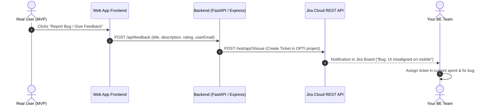

# Jira for SPPU BE Final Year Project: Complete Guide

## Why Jira? (Especially for Beginners & College Projects)

Jira is an industry-standard Agile project management platform created by Atlassian. For your SPPU BE project, Jira solves three major problems:

1. **Academic Proof of Agile Methodology:** SPPU examiners ask: *"How did your 4-member group divide work? Show sprint logs."* Jira automatically generates Burndown charts, Sprint reports, and Velocity charts that you can directly screenshot into Chapter 3/4 of your project report.
2. **Centralized User Feedback for Live MVP:** When real users test your MVP, bugs and feature requests flow straight into Jira as tickets instead of getting lost in WhatsApp messages or Google Forms.
3. **Research Data Generator:** The timestamps, resolution times, and issue categories in Jira provide empirical data (e.g., bug resolution latency, user satisfaction metrics) for the **Results and Discussion** section of your research paper.

---

## Key Jira Concepts Made Simple

| Concept | What it is in simple terms | Example in Opti Build |
|---|---|---|
| **Project** | The container for your entire BE project. | `SCRUM` (**Opti Builders**) |
| **Epic** | A major milestone or module (takes multiple weeks). | `EPIC 1: Literature Survey & Math Model` `EPIC 2: Optimization Engine` `EPIC 3: Live MVP Frontend` `EPIC 4: Jira Feedback Integration` |
| **User Story** | A user-facing feature requirement. | *"As a user, I want to input my budget so the system suggests the optimal configuration."* |
| **Task** | An engineering or research action item. | *"Implement Set Theory equations in Chapter 3"* or *"Set up FastAPI backend"*. |
| **Bug** | A defect reported by you or real MVP testers. | *"Budget filter crashes when negative numbers are entered."* |
| **Sprint** | A fixed 1 to 2-week time box to finish selected tasks. | `Sprint 1: Problem Statement & Literature Survey (Oct 1 - Oct 14)` |
| **Backlog** | The to-do list of everything planned for the project. | All unassigned tasks waiting for future sprints. |

---

## How to Set Up Your Jira Workspace (Step-by-Step)

### Step 1: Create a Free Atlassian Jira Cloud Account
1. Go to [jira.atlassian.com](https://www.atlassian.com/software/jira) and sign up (Free tier supports up to 10 users).
2. Choose **Jira Software**.
3. Create a project using the **Scrum** or **Kanban** template:
   - **Project Name:** `Opti Build`
   - **Key:** `OPTI`

### Step 2: Structure Your Epics (Aligning with SPPU Milestones)
Create these 4 core Epics in Jira:
- **`[OPTI-E1]` Academic & Research:** Literature survey, IEEE paper drafting, mathematical modeling, synopsis.
- **`[OPTI-E2]` Core Engine:** Optimization algorithms, benchmarking, heuristic pruning.
- **`[OPTI-E3]` MVP Web Application:** UI dashboard, REST API, database storage.
- **`[OPTI-E4]` Live Feedback & Telemetry:** In-app feedback form, Jira REST API webhook integration.

### Step 3: Run 2-Week Sprints with Your Group
1. Move 5–8 tasks from the Backlog into **Sprint 1**.
2. Assign tasks to each team member (Member 1: Survey paper, Member 2: Frontend, Member 3: Backend, Member 4: Math model).
3. Daily or weekly: Drag tickets from **To Do** $\to$ **In Progress** $\to$ **Done**.
4. When the sprint ends, click **Complete Sprint** — Jira generates a **Sprint Burndown Chart**!

---

## How Jira Connects to Your Live MVP Feedback

### Benefits for Your External Viva:
- When the external examiner asks: *"How do you know your system actually works in practice?"*
- You show the live Jira dashboard: *"Here are 45 real feedback tickets submitted by beta testers over 3 weeks. 32 were resolved, 8 were feature enhancements incorporated into Version 2."*
- Examiners rarely see this level of real-world rigor in undergraduate projects, which gives your team top marks.
